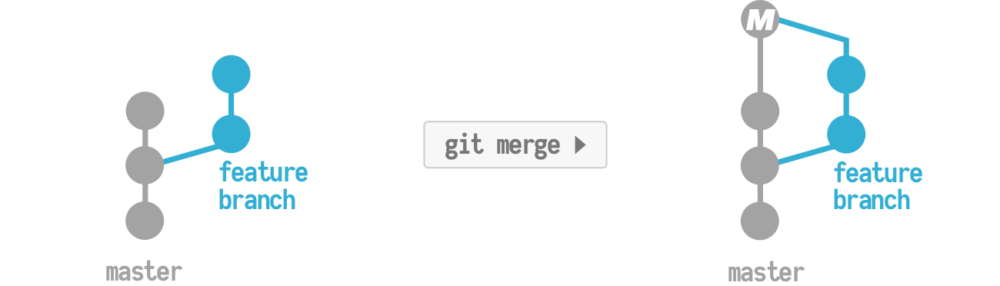
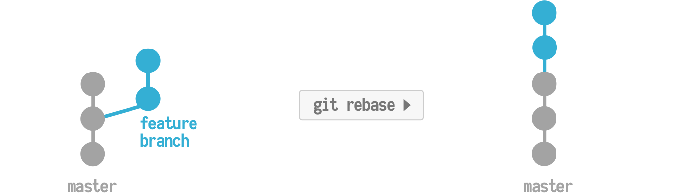

 

Primeiro vamos entender a diferença entre o git merge e o git rebase, para isso vamos imaginar duas branches, main e feature.

O git merge irá pegar todas as mudanças que você fez na branch feat e juntar tudo em apenas um commit dentro da sua main. 

O git rebase irá pegar commit por commit que você na branch feat e vai mover esses commits no topo da sua main.

O seu "erro" na verdade é um conflito entre suas branches, pois contém diferentes tipos de versões do mesmo arquivo, no caso o README.md, para tentar resolver esse conflito vamos tentar fazer o seguinte. 
Os conflitos acontecem não só com alterações dentro dele, mas também com arquivos apagados em um branch e esse mesmo arquivo editado em outra.

```bash  
  git rebase --abort # Pare o processo de rebase
  git checkout master # Ir para a branch master
  git pull # Puxar todas as mudanças do remote pro seu repo local
```

Se na branch master você estiver com o README.me , apague ele e faça um commit.

Ai na sua master vamos fazer o seguinte:
```bash
git checkout titulo
git rebase -X theirs master # o -X vem de strategy options que juntando com theirs estamos dizendo que para todos os conflitos que acontecerem iremos manter das mudanças feitas na branch de titulo.
```

Creio que isso já deve resolver os conflitos, qualquer coisa chama ai. (editado)




